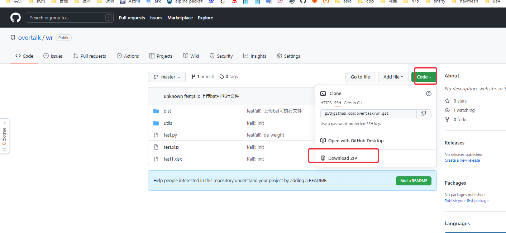

# 使用手册

- 下载解压



- 进入 dist 目录, 使用txt打开 `生成excel表.bat` 文件，文件内容如下

	```bat
	test.exe --target_year=2022 --target_week=6 --excel=D:\python\wr\wr1.xlsx --sheet=Sheet1
	pause
	```

	- 可根据需求更改 `年份`，`周数`，`数据表excel路径`，`数据表excel sheet名` 等参数

- 改修保存，双击 `生成excel表.bat` 会在当前目录生成 excel 结果


